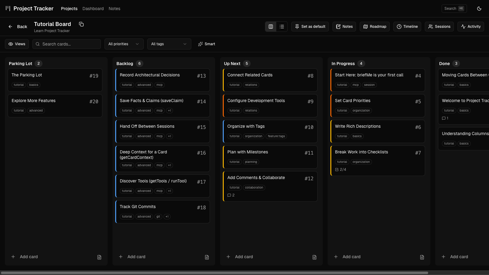
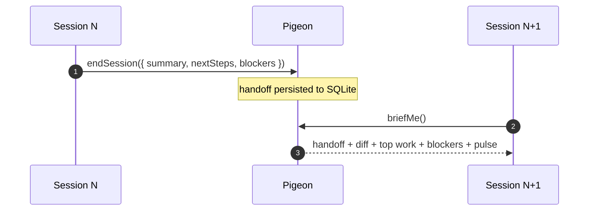
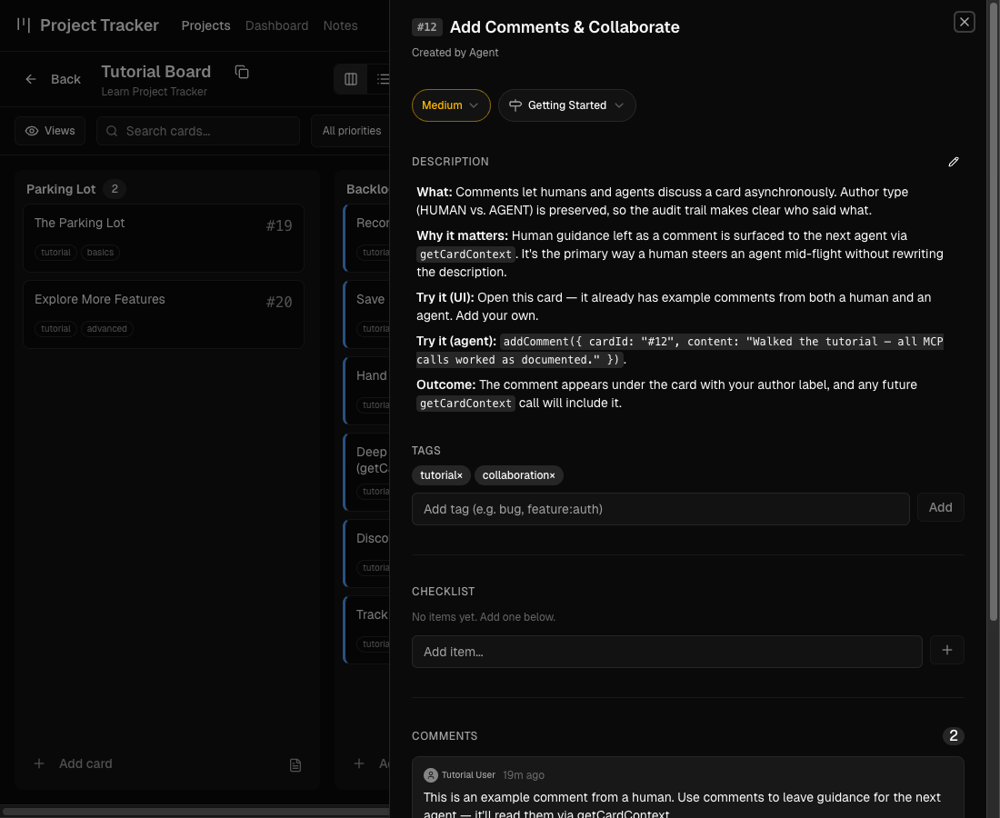

<div align="center">


# Pigeon

**A local-first kanban board that carries context between AI coding sessions.**

You see a board. The agent reads and writes the same board through MCP. Nothing leaves your machine.

[Documentation](https://2nspired.github.io/pigeon/) · [Quickstart](https://2nspired.github.io/pigeon/quickstart/) · [The session loop](https://2nspired.github.io/pigeon/workflow/) · [Why local-first?](https://2nspired.github.io/pigeon/why/)

[](LICENSE) [](https://modelcontextprotocol.io) [](#why-pigeon)

<br />



</div>

---

## Why Pigeon

Coding-agent conversations have a natural expiration. Context windows fill, token costs climb, or you just want a clean slate. The question isn't *whether* the conversation ends — it's **what carries across the gap**.

Today the answer is usually "you do" — you re-explain what was planned, what's done, what was decided, what's stuck. Pigeon's answer is a structured handoff written at the end of one session and read at the start of the next. No re-explaining. No lost decisions. No "wait, what were we doing?"

The metaphor is in the name: agent A finishes a session and releases context at `endSession`; the homing pigeon flies it across the gap; agent B catches it at `briefMe` and starts in-context.



The handoff is a SQLite row. The wire is your local disk, not a network. The next session's first move is `briefMe`; what comes back is the previous handoff, a diff of what changed since, the top three work-next candidates, open blockers, recent decisions, and a one-line pulse.

## Built for two readers

| Reader | Sees | Reads/writes via |
|---|---|---|
| **You** | Kanban board in the browser. Drag-and-drop, columns, priorities, checklists, activity, real-time updates over SSE. | The web UI at `localhost:3100`. |
| **Your agent** | Structured tools over MCP. Cards, columns, comments, handoffs, decisions, dependencies, code links. | 10 essential tools always-on; 60+ extended tools discoverable via `getTools` and called via `runTool`. Context footprint stays small. |

The same SQLite file serves both, all the time, with no sync layer between them. If you can see it in the UI, the agent can see it. If the agent writes it, you see it live.

## 60-second install

```bash
git clone https://github.com/2nspired/pigeon.git
cd pigeon
npm install
npm run setup            # creates the DB; optionally seeds a tutorial
npm run service:install  # macOS: registers a launchd service on :3100
                         # other platforms: npm run dev (foreground on :3000)
npm run doctor           # verifies the install (see below)
```

Then, from inside any project you want to track:

```bash
/path/to/pigeon/scripts/connect.sh
```

That writes a `.mcp.json` in the project's repo root. Start a new chat with your agent in that directory and ask it to run `briefMe`.

## Verify with `npm run doctor`

Pigeon ships its own install-health diagnostic — eight checks for legacy config drift, version skew, and database state, with copy-pasteable fix commands for any failure.

```text
Pigeon Doctor — install health check
────────────────────────────────────
✓ MCP registration             PASS
✓ Hook drift                   PASS
✓ launchd label                PASS
✓ Connected repos              PASS
✓ Server version               PASS
✓ Per-project tracker.md       PASS
✓ WAL hygiene                  PASS
✓ FTS5 sanity                  PASS

8 pass
All checks passed.
```

Run it after install and after every `git pull`. Exit code is `0` on green, `1` on any failure — CI-friendly.

## What you get

<table>
<tr>
<td width="50%" valign="top">

### The board

Cards as units of work. Columns as state. Priority as a colored stripe. Tags filter; comment and checklist counters surface card depth at a glance. Card numbers (`#42`) stay stable across sessions and never recycle, even after deletion — agent references resolve months later.

</td>
<td width="50%" valign="top">

### The card

The single screen where humans and agents converge. Description for scope. Checklist for sub-state. Comments for guidance. Dependencies for graph structure (`blocks`, `blockedBy`, `relatedTo`). Activity feed for the audit trail.

</td>
</tr>
<tr>
<td valign="top">


</td>
<td valign="top">



</td>
</tr>
</table>

## MCP surface

Pigeon's MCP server registers under the key `pigeon` and runs over stdio. Ten essential tools are always on; the rest are discoverable.

<!-- tracker:essentials:start -->
### Essential Tools (10)

| Tool | What it does |
| --- | --- |
| `briefMe` | One-shot session primer — handoff, diff, top work, blockers, recent decisions, pulse. |
| `endSession` | Session wrap-up — saves handoff, links commits, reports touched cards, returns resume prompt. |
| `createCard` | Create a card in a column (by name). |
| `updateCard` | Update card fields; optional `intent`. |
| `moveCard` | Move a card to a column. Requires `intent`. |
| `addComment` | Add a comment to a card. |
| `registerRepo` | Bind a git repo path to a project (call after briefMe returns needsRegistration). |
| `checkOnboarding` | Detect DB state, list projects/boards, session-start discovery. |
| `getTools` | Browse extended tools by category. |
| `runTool` | Execute any extended tool by name. |
<!-- tracker:essentials:end -->

60+ extended tools (cards, checklist, context, decisions, diagnostics, discovery, git, milestones, notes, relations, sessions, setup, tags) are discoverable via `getTools` and executable via `runTool`. The full reference: [MCP tools](https://2nspired.github.io/pigeon/tools/).

## Project policy: `tracker.md`

Every connected project gets a `tracker.md` at its repo root — a Markdown file with YAML frontmatter that tells Pigeon how agents should behave when they're working on this project specifically. Hot-reloaded on every MCP tool call, git-versioned, reviewable in PRs.

```markdown
---
schema_version: 1
project_slug: my-project
intent_required_on:
  - moveCard
  - deleteCard
columns:
  In Progress:
    prompt: |
      Limit to 2-3 cards. Move here when you start writing code,
      not when planning.
---

# Project policy for my-project

Current phase: shipping the v2 onboarding flow. Treat anything
outside that as backlog unless it's blocking the release.
```

The rule: *if the human can't see and edit it where they'd naturally encounter it, the agent shouldn't trust it.* Full guide: [Write a tracker.md](https://2nspired.github.io/pigeon/tracker-md/).

## Stack

- **App** — Next.js 16 (App Router, Turbopack), React 19, TypeScript, tRPC v11, React Query v5, Tailwind 4, shadcn/ui (new-york).
- **Data** — Prisma 7 + SQLite (`data/tracker.db`). WAL mode for concurrent read/write across the MCP and web processes.
- **MCP** — `@modelcontextprotocol/sdk`, stdio transport. The MCP server is a separate process from the web UI; both read the same SQLite file.
- **Search** — SQLite FTS5 (`knowledge_fts` virtual table) for cross-entity search across cards, comments, decisions, notes, handoffs, code facts, and repo docs.
- **Real-time** — Server-Sent Events for board updates, with polling fallback.
- **Drag-and-drop** — `@dnd-kit/core` + sortable.
- **Docs site** — Astro 5 + Starlight, custom Astro components, no JS framework gymnastics. Builds to static at `docs-site/dist/`.
- **Tests** — Vitest, jsdom for DOM-bound paths, React Testing Library for components.

## Commands

| Script | What it does |
| --- | --- |
| `npm run dev` | Foreground dev server with hot reload on `:3000`. |
| `npm run setup` | Interactive setup wizard (DB + tutorial + connect). |
| `npm run mcp:dev` | Run the MCP server standalone for testing. |
| `npm run doctor` | Install health check — 8 diagnostics with copy-pasteable fixes. |
| `npm run service:install` / `:start` / `:stop` / `:logs` / `:update` | macOS launchd service on `:3100`. |
| `npm run db:push` / `:seed` / `:studio` | Schema sync, tutorial seed, Prisma Studio. |
| `npm run migrate-rebrand` | One-shot v4 → v5 rebrand migration (idempotent). |
| `npm run release` | Verify version agreement across carriers, run quality gates, tag and push. |
| `npm run docs:dev` / `:build` / `:check` | Docs site dev / build / parity check (README + tools.mdx). |
| `npm run test` / `lint` / `type-check` | Vitest, Biome, TypeScript. |

## Documentation

The full docs site lives at **[2nspired.github.io/pigeon](https://2nspired.github.io/pigeon/)**.

**Start here**
- [Quickstart](https://2nspired.github.io/pigeon/quickstart/) — clone, install, connect, first `briefMe` call.

**Concepts**
- [Mental model](https://2nspired.github.io/pigeon/concepts/) — sessions, handoffs, the briefMe loop, the deprecation calendar.
- [Design rationale](https://2nspired.github.io/pigeon/why/) — why local-first, why MCP-native.

**How-to**
- [The session loop](https://2nspired.github.io/pigeon/workflow/) — the four moves: briefMe, work, endSession, resume.
- [Plan a card](https://2nspired.github.io/pigeon/plan-card/) — structured planning with the `planCard` tool.
- [Write a tracker.md](https://2nspired.github.io/pigeon/tracker-md/) — your project's policy contract.
- [Avoid anti-patterns](https://2nspired.github.io/pigeon/anti-patterns/) — common pitfalls and the fixes.

**Reference**
- [MCP tools](https://2nspired.github.io/pigeon/tools/) — every tool the agent can call.
- [`docs/SURFACES.md`](docs/SURFACES.md) — `tracker.md` vs `CLAUDE.md` vs `AGENTS.md` cheat sheet.
- [AGENTS.md](AGENTS.md) — contributor reference for agent conventions.

## Releases & upgrades

- [CHANGELOG.md](CHANGELOG.md) — what changed in each release. Keep-a-Changelog format with cards linked.
- [docs/UPDATING.md](docs/UPDATING.md) — what to run after `git pull`. `npm run service:update` alone is not always enough.
- [docs/MIGRATING-TO-PIGEON.md](docs/MIGRATING-TO-PIGEON.md) — the v4 → v5 walkthrough (run `npm run migrate-rebrand` once, then `npm run doctor` to verify).
- [docs/VERSIONING.md](docs/VERSIONING.md) — semver + schema-version policy.

## License

[MIT](LICENSE).
