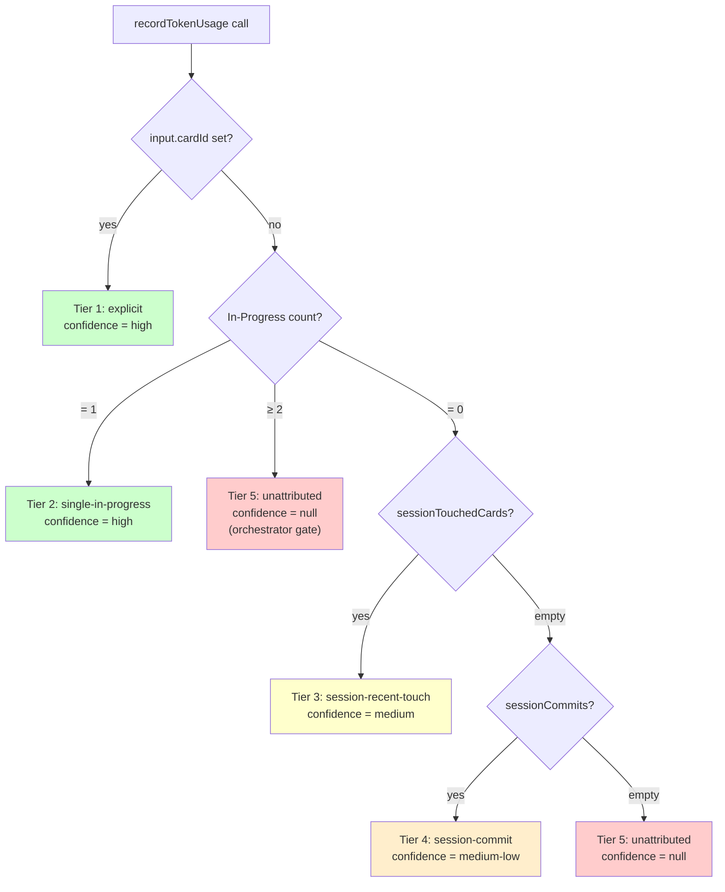

import { Aside } from "@astrojs/starlight/components";

Every Claude Code session ends with a Stop hook that writes one row per `(sessionId, model)` into `TokenUsageEvent`. That row carries a `cardId` column the [Costs page](/costs/) aggregates against. The question is: **which card?**

Before the engine, the answer was heuristic and undocumented. `briefMe` would call `attributeSession` if it could, the Stop hook used whatever it could see, and multi-card sessions silently bound to the most-recent thing. The Costs UI couldn't tell *why* a row was attributed, only the result.

The Attribution Engine (#268, #269) replaces that with a documented, pure-function decision. Every write runs through five tiers and persists both the picked `cardId` and the `signal` that produced it.

## The five tiers



Source: `src/lib/services/attribution.ts` (the `attribute()` function). The function is pure — no Prisma, no I/O. The snapshot is built separately so the heuristic stays unit-testable.

| Tier | Signal | Confidence | When it fires |
|---|---|---|---|
| 1 | `explicit` | `high` | Caller passed `cardId` (e.g. agent attributing manually). Always wins, even when multi-In-Progress would otherwise short-circuit. |
| 2 | `single-in-progress` | `high` | Exactly one card on the project's active board(s) has `column.role = "active"`. The pinned-focus heuristic — board state asserts "this is what we're working on." |
| 3 | `session-recent-touch` | `medium` | Most-recently-touched card in *this MCP session* (move / update / comment). **Currently always empty** — `sessionTouchedCards` is stubbed in `attribution-snapshot.ts`, deferred to #272. |
| 4 | `session-commit` | `medium-low` | Most-recent commit-link from this session's worktree. **Currently always empty** — same #272 deferral. |
| 5 | `unattributed` | `null` | Multi-In-Progress (orchestrator-mode short-circuit) *or* no signal at all. |

## The orchestrator gate (Tier 5a vs 5b)

When ≥ 2 cards are In-Progress, the engine short-circuits to `unattributed` *without* falling through to tiers 3 and 4. The reasoning is in the source comment:

> Multi-In-Progress short-circuits — orchestrator-mode gate. Do NOT fall through to session-touch or commit signals; the human pinned multiple cards to convey "this is multi-card work, don't guess."

This is the explicit acceptance criterion from #267: ≥ 2 In-Progress cards on the active board mean the session is doing orchestration, not card-focused work. **Wrong > empty.** The `explicit` signal still wins over the gate because the agent is asserting *this work goes here* and that beats inferred state.

"In Progress" is project-scoped: any card whose column has `role = "active"` on any board within this project. Multi-board projects with one card pinned per board therefore count as multi-In-Progress.

## Schema columns

```prisma
// prisma/schema.prisma
signal           String?  // 'explicit' | 'single-in-progress' | 'session-recent-touch' | 'session-commit' | 'unattributed'
signalConfidence String?  @map("signal_confidence")
```

Both columns are nullable. `signal` is null for pre-#269 rows; #270 (deferred) would backfill them. `signalConfidence` is null whenever `signal = 'unattributed'`.

Storing confidence as a column rather than deriving it from `signal` lets future heuristic tuning change confidence labels without a re-attribution pass.

## How the writers call it

Two write paths, both in `src/lib/services/token-usage.ts`:

1. **`recordManual`** — fired by the `recordTokenUsage` MCP tool and the Codex manual path. Builds a snapshot, calls `attribute()`, persists `signal` + `signalConfidence` alongside the token columns.
2. **`recordFromTranscript`** — fired by the Claude Code Stop hook. Idempotent (delete-and-replace on `sessionId`). Re-runs prefer fresh single-In-Progress attribution over stale `attributeSession` cardIds while still preserving prior attribution when the engine returns null.

Both call the same `buildAttributionSnapshot(prisma, projectId)` helper before the pure-function decision.

There's also a separate manual override path: the `attributeSession` MCP tool writes a `cardId` to all rows for a sessionId without consulting the engine. It's the "I was working on #N, I forgot to mark it" escape hatch; auto-called from `briefMe` (when the session has a known active card) and `saveHandoff` (when exactly one card was touched).

## The three-bucket gap UX

The Costs page splits the unattributed gap into three architecturally distinct buckets so the user sees *why* a session is unattributed and what to do about it:

| Bucket | SQL shape | What it means | Action implied |
|---|---|---|---|
| `attributed` | `cardId IS NOT NULL` | Engine assigned a card, or `attributeSession` did | Nothing — this is the happy path |
| `unattributed` | `cardId IS NULL` AND at least one row has `signal IS NOT NULL` | Engine ran and decided null (multi-In-Progress, or no signal) | Review your workflow — this is what the engine sees |
| `preEngine` | `cardId IS NULL` AND `signal IS NULL` | Pre-#269 row, written before the engine | Wait for the deferred backfill (#270), or accept the historical drag |

The buckets are session-distinct (not event-distinct) since the user-meaningful unit is the session. Costs are summed across all events per bucket. The card on the Costs page hides when both `unattributed` and `preEngine` are zero.

<Aside type="note" title="Where this lands in the UI">
The buckets render in the unattributed-gap card on each project's Costs page. See [Cost tracking](/costs/) for the full math behind every section.
</Aside>

## Pre-engine drag (#270 deferral)

Pre-#269 rows have no `signal` and no `cardId`. They'll show up in the `preEngine` bucket forever unless backfilled. #270 (the historical-backfill card) was deferred behind a 30-day re-evaluation window pending #213's UX validating that the engine is calling cards correctly enough to trust on history.

> Unblocks the 30-day re-evaluation window for #270 (historical backfill) and #272 (tail signals 3+4).

If the user sees the engine attributing wrongly in the wild, #270 stays deferred — wrong attribution on history is worse than empty attribution. If the engine looks healthy, #270 turns into a one-shot script that runs `attribute()` over historical rows.

## Tail-signal deferral (#272)

Tiers 3 and 4 require:

- `sessionTouchedCards` — `Activity` rows scoped to *this MCP session*, not the agent globally. Activity has no `sessionId` column today.
- `sessionCommits` — `GitLink` rows scoped to this session's worktree. Same — no `sessionId` on `GitLink`.

Adding both is a schema change plus a session-id correlation strategy. The MCP server's `SESSION_ID` and Claude Code's own session UUID don't bind today, so even joining `Activity` rows on a future `sessionId` column wouldn't recover the per-session scope without an additional binding primitive. Until that lands, the snapshot builder returns `[]` for both fields and `attribute()` falls through past tiers 3 and 4 to `unattributed`. The function never returns a wrong card just because a stub is empty.

## Adjacent fix: ToolCallLog projectId (#277)

Architecturally distinct from attribution but the same shape of failure mode: as of #277, `tool_call_log` carries `projectId` directly (stamped at write time in `src/mcp/instrumentation.ts`) instead of bridging through `token_usage_event`. The previous bridge collapsed to `[]` when the Stop hook didn't fire — `getProjectPigeonOverhead` returned $0 even when MCP traffic was real.

Orphan rows from before this fix stay `NULL` by design. The backfill at `scripts/backfill-tool-call-log-projectid.ts` fills them best-effort by joining on `sessionId` to `TokenUsageEvent`; rows whose sessions never emitted a Stop-hook payload remain `NULL` and are excluded from project-scoped overhead aggregations. They're still visible to the global `getToolUsageStats` view.

This isn't an Attribution-Engine path (it doesn't run `attribute()`), but it mirrors it — the same kind of silent zero, the same kind of "wire it directly at write time" fix.

## Open work

- **#270** — historical backfill of `signal` for pre-#269 rows. Deferred behind 30-day window opened by #213.
- **#272** — populate `sessionTouchedCards` and `sessionCommits`. Blocked on session-id correlation primitive.
- The function itself has no known correctness bugs; it's the *snapshot* that's incomplete.

## See also

- [Cost tracking](/costs/) — every Costs-page section that aggregates over the engine's output.
- [Data model](/data-model/) — the `signal` / `signalConfidence` columns in context.
- [Architecture](/architecture/) — why the engine is a pure function in `src/lib/services/`, not a tRPC procedure.
- [`docs/ATTRIBUTION-ENGINE.md`](https://github.com/2nspired/pigeon/blob/main/docs/ATTRIBUTION-ENGINE.md) on GitHub — in-repo source-of-truth with file:line citations.
