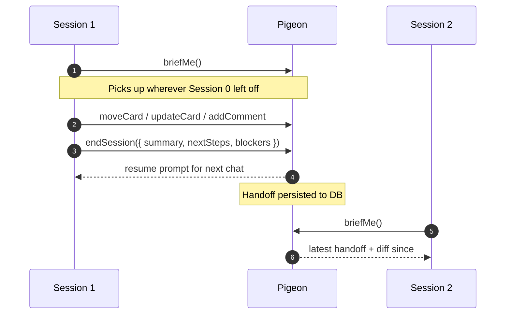

import { Aside } from "@astrojs/starlight/components";

If [the session loop](/workflow/) tells you *how* Pigeon works day-to-day, this page tells you what the parts **are** — the pieces of the model and how they relate. Read this when you want to know why a feature exists, not just how to use it.

## Sessions

A **session** is one continuous conversation with a coding agent. It starts when you open a chat, runs until the conversation ends, and produces an output: code changes, decisions, follow-ups, or just understanding.

Pigeon doesn't define what a session is — your agent does. Claude Code, Codex, Cursor, and Windsurf each scope conversations slightly differently. Pigeon's job is to make the **boundaries between sessions** legible: what was done, what's outstanding, what context the next session needs to pick up cleanly.

The lifecycle Pigeon cares about is not the conversation, it's the **handoff at the end of one session and the brief at the start of the next**. Everything else flows from those two events.



The arrows that matter are #1 and #5: `briefMe` at session start, `endSession` at end. Everything in between is your work.

## Handoffs

A **handoff** is the structured artifact that carries context across the gap between sessions. It's a small JSON object — kept lean on purpose — that captures what the previous session decided you'd want to know.

The shape:

```typescript
{
  agentName: string;        // who wrote it (Claude, Codex, etc.)
  createdAt: string;        // ISO timestamp
  summary: string;          // one paragraph: what just happened
  workingOn: string[];      // active threads — what you'd resume
  findings: string[];       // discoveries, surprises, gotchas
  nextSteps: string[];      // suggested actions for the next session
  blockers: string[];       // anything stuck that needs unblocking
}
```

Handoffs are written by `endSession` and read by `briefMe`. They live in the `note` table with `kind: "handoff"`, are scoped per board, and roll forward — every new handoff becomes the next session's primer.

The blockers field is special: when a handoff has open blockers, `briefMe` opens that section first and surfaces it in the pulse line. If a session ended with a question, the next session sees the question.

<Aside type="tip" title="Handoffs are not journals">
Resist the urge to write everything that happened. The next session doesn't need a transcript — it needs the smallest set of things that lets it pick up. Five-line summaries beat fifty-line ones.
</Aside>

## The briefMe loop

`briefMe` is the entry point for every session. It returns about 300–500 tokens — a tiny fraction of a `getBoard` call — focused on **what changed** since the last handoff:

- **The latest handoff** (verbatim, so the agent reads what its predecessor wrote)
- **A diff since that handoff** — cards moved, cards created, new comments, checklist progress
- **Top work** — three highest-scored candidates for what to tackle next
- **Active blockers** — any open blocker tagged across the board
- **Recent decisions** — `claim` rows with `kind: "decision"` from the last 7 days
- **Staleness warnings** — anything that's been sitting too long
- **A pulse line** — single sentence summary for the agent's first message

The token budget is deliberate. `briefMe` runs at the start of every session; if it's expensive, you won't run it. Cheap means you always run it. Always running means context never drops.

The loop:

1. **`briefMe`** — primes the agent with what's relevant.
2. **Work** — agent calls `moveCard`, `updateCard`, `addComment`, `planCard`, etc., always with `intent` on writes that need it.
3. **`endSession`** — writes the next handoff, links any new commits, returns a resume prompt.
4. **Next session opens with `briefMe`.** Goto 1.

If you only ever follow these four steps, you've got the loop right. Everything else in Pigeon is in service of making them cheap, structured, and useful.

## Cards, columns, and the board

Cards are units of work. Columns describe state. Boards group columns under a project. That's it — same shape as every other kanban tool.

Where Pigeon differs is what cards **carry**:

- **A description** that's expected to outlive the conversation that created it. Plans, decisions, screenshots, links to the relevant code.
- **An activity feed** that records every move, every intent, every comment, in order, by actor. Auditable history.
- **A checklist** that the agent can tick off as work progresses, visible to you live.
- **Relations** — `blocks`, `blockedBy`, `relatedTo` — that turn the board from a flat list into a graph.
- **A milestone** — release horizon, not a date. A card without a milestone is "later."

The agent reads cards via `briefMe` summaries and `getCardContext` deep-dives, writes via `updateCard` / `addComment` / `moveCard`. Same model, two clients (you and the agent), one source of truth.

## Surfaces

Pigeon distinguishes three kinds of project file at the repo root:

- **`tracker.md`** — runtime board policy. Read by Pigeon's MCP tools on every call. Hot-reloaded. See the [`tracker.md` page](/tracker-md/).
- **`CLAUDE.md`** — Claude Code's session-start prompt. Read once per Claude Code session. Build commands, code conventions, repo-specific instructions.
- **`AGENTS.md`** — cross-agent contributor reference. Read on demand. Tool migration history, tag conventions, "when to use the board" prose.

The principle: **if the human can't see and edit it where they'd naturally encounter it, the agent shouldn't trust it.** Each surface answers a different question; none should bleed into the others.

## The dual-bin deprecation calendar

Pigeon's versioning policy is conservative on purpose: every breaking change has a non-breaking alias that lasts a major version, then goes away.

| When | What's gone |
|---|---|
| **v5.x today** | Dual-bin: `mcpServers.project-tracker` + `scripts/mcp-start.sh` still work alongside the new `mcpServers.pigeon` + `scripts/pigeon-start.sh`. Legacy paths emit a `_brandDeprecation` field nudging migration. |
| **v6.0** | Legacy alias removed. `mcpServers.project-tracker` stops working; `mcp-start.sh` is deleted. You must have completed the rename per [`MIGRATING-TO-PIGEON.md`](https://github.com/2nspired/pigeon/blob/main/docs/MIGRATING-TO-PIGEON.md). Run `npm run doctor` to verify before you upgrade. |
| **Permanent** | `tracker.db` filename, `tracker.md` filename, all MCP tool names (`briefMe`, `endSession`, etc.), Prisma table names, the `tracker://` URI scheme. None of these change. |

The promise: any v5.x release is non-destructive. You can pull, deprecation warnings appear, your install keeps working. v6.0 is the cutover; everything before it gives you time.

`npm run doctor` (added in v5.1) runs eight checks against your install and tells you exactly what's still on the legacy path. If `doctor` is green going into v6.0, the upgrade is uneventful.

## Why local-first

Three deliberate calls baked in:

- **SQLite on disk.** No accounts, no sync server, no tenancy. One file, owned by you. The agent reads and writes it via MCP over stdio.
- **MCP-native.** Pigeon doesn't ship a custom UI for your agent to call. Any MCP-aware agent works — Claude Code, Codex, Cursor, Windsurf, and whatever ships next.
- **Essential + catalog split.** The 10 always-on tools are tiny (`briefMe`, `endSession`, `createCard`, `updateCard`, `moveCard`, `addComment`, `registerRepo`, `checkOnboarding`, `getTools`, `runTool`). The other 50+ tools are discoverable via `getTools` and called via `runTool`. Your agent's system prompt stays small.

The trade is real: no cloud sync (you sync the file via Git, Syncthing, Dropbox), no team mode (one human + N agents, by design), no network access when the file's on a machine you're not on. Read [the design rationale](/why/) for the full picture.

## See also

- [The session loop](/workflow/) — how the briefMe → work → endSession cycle runs in practice
- [`tracker.md`](/tracker-md/) — your project's policy file
- [Plan a card](/plan-card/) — structured planning protocol
- [Anti-patterns](/anti-patterns/) — the ways people trip themselves up
- [Design rationale](/why/) — why local-first, why MCP-native
