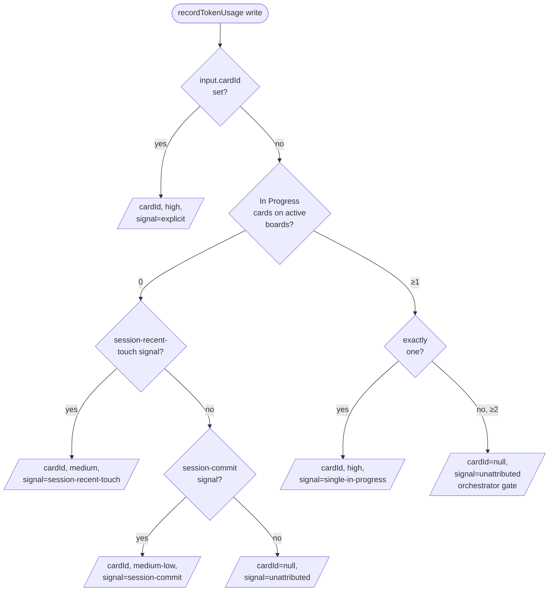

import { Aside } from "@astrojs/starlight/components";

The Costs page (`/projects/[projectId]/costs`) is Pigeon's per-project lens onto what your AI sessions cost, how briefMe paid for itself, what Pigeon's own tool calls drag in, and which sessions / cards drove the bill. This page is the engineer-readable explainer behind those numbers — every claim should be checkable against a file:line in the codebase.

If you haven't wired up token tracking yet, start with the in-app **Set up token tracking** dialog (Pulse strip CTA, or any project's Costs page). This page assumes events are flowing.

<Aside type="note" title="Local-only, opt-in">
Token tracking only fires when Claude Code's Stop hook is installed (or you call `recordTokenUsage` manually). Pigeon never reads transcript content — only `message.usage` and `message.model`. See [`docs/token-tracking.md`](https://github.com/2nspired/pigeon/blob/main/docs/token-tracking.md) for the operator setup guide.
</Aside>

## Pricing model

Per-event cost is `tokens × rate`, summed across five token columns and five rate columns:

| Column                  | What it counts                          | Rate field                    |
| ----------------------- | --------------------------------------- | ----------------------------- |
| `inputTokens`           | Tokens the model read on the prompt     | `inputPerMTok`                |
| `outputTokens`          | Tokens the model emitted                | `outputPerMTok`               |
| `cacheReadTokens`       | Anthropic prompt-cache hits             | `cacheReadPerMTok`            |
| `cacheCreation1hTokens` | Tokens written into the 1-hour cache    | `cacheCreation1hPerMTok`      |
| `cacheCreation5mTokens` | Tokens written into the 5-minute cache  | `cacheCreation5mPerMTok`      |

OpenAI-shaped flat input/output pricing collapses to the first two columns; the cache-creation columns sit at zero. The five-column shape preserves Anthropic prompt-cache fidelity without forking the schema per provider.

### Where defaults come from

Default rates ship in `src/lib/token-pricing-defaults.ts`. The `PRICING_LAST_VERIFIED` constant (currently **`2026-04`**, see `src/lib/token-pricing-defaults.ts:18`) is the date a human last cross-checked the rates against each provider's pricing page. The Pricing override table renders an amber banner with that date; if it's been months, cross-check and override anything that's drifted. The banner is informational — it doesn't gate functionality.

### Per-project overrides

The **`PricingOverrideTable`** at the bottom of the Costs page lets you override any rate per-model (and add models the defaults don't know about). Overrides persist on `Project.metadata.pricing` and take precedence over the defaults at every call site that prices an event. Empty rate fields persist as `0` (useful for OpenAI, where cache-creation columns don't apply). Models with no entry on either side fall through to a `__default__` zero-rate row, which produces a clean `$0` cost and an amber "Unknown model" warning row.

## Token-event lifecycle

```
┌─────────────────┐    ┌──────────────────┐    ┌──────────────────────┐
│  Claude Code    │ →  │  scripts/        │ →  │ recordTokenUsage MCP │
│  Stop hook      │    │  stop-hook.sh    │    │ (recordFromTranscript)│
└─────────────────┘    └──────────────────┘    └──────────┬───────────┘
                                                          │
                                                          ▼
                                          ┌──────────────────────────┐
                                          │  attribute() decides     │
                                          │  cardId + signal         │
                                          │  (attribution.ts:90)     │
                                          └──────────┬───────────────┘
                                                     ▼
                                ┌────────────────────────────────────┐
                                │ TokenUsageEvent row                │
                                │   (sessionId, model) → priced      │
                                │   row (cardId, signal,             │
                                │   signalConfidence)                │
                                └────────────────────────────────────┘
```

1. **Stop hook fires** at the end of every Claude Code session. The hook reads the JSONL transcript line-by-line, sums `message.usage` per `message.model`, and posts to the `recordTokenUsage` MCP tool.
2. **`recordFromTranscript`** writes one `TokenUsageEvent` row per `(sessionId, model)` tuple (`src/lib/services/token-usage.ts:514`). The Attribution Engine runs once per write to pick `cardId` (see [Attribution Engine](#attribution-engine)).
3. **Pricing happens at write time**: each row's tokens are multiplied by the row's `model` rates and stored alongside the row.
4. **Aggregation** is a SQLite scan, in-memory roll-up:
   - `getProjectSummary` produces the headline cells in `<SummaryStrip>` plus the `attributionBreakdown` for the gap card.
   - `getDailyCostSeries` produces the 7-day sparkline (UTC-bucketed).
   - `getCardSummary` and `getCardDeliveryMetrics` aggregate per card.
   - `getProjectPigeonOverhead` aggregates `tool_call_log` rows separately.

Codex and other agents go through the manual `recordTokenUsage` MCP tool — same row shape, same downstream math.

## Attribution Engine

`TokenUsageEvent` rows would otherwise sit at `cardId = null` — the Stop hook only knows the session's working directory, not which card the agent worked on. Pigeon closes that gap with the **Attribution Engine** (#268, #269), a pure function that picks one card per session at write time.

### Decision order

The engine runs *per session*, not per call. The dominant write path (Stop hook → `recordFromTranscript`) aggregates a whole session into one row per model, so per-call attribution within a session isn't representable in the current row model. Multi-card sessions classify as `unattributed` by design — wrong > empty.



The full ordered logic lives in `src/lib/services/attribution.ts:90` — the function is pure, takes an `AttributionInput` plus an `AttributionStateSnapshot`, and returns `{ cardId, confidence, signal }`. The decision in source-code order (most → least confident):

1. **Explicit `cardId`** from the MCP caller → `confidence: high`, `signal: explicit`. The agent is asserting "this work goes here"; we trust that even when multi-In-Progress would otherwise short-circuit.
2. **Single In-Progress card** on the project's active board(s) → `confidence: high`, `signal: single-in-progress`. The "Move to In Progress before working" workflow makes this the dominant path for solo work.
3. **Most-recent session-touched card** (signal 3) — *deferred to #272*. Currently returns `unattributed` because the snapshot builder stubs `sessionTouchedCards: []` (`src/lib/services/attribution-snapshot.ts:36`).
4. **Most-recent session-commit link** (signal 4) — *deferred to #272*. Same reason; `sessionCommits: []` is stubbed in the snapshot.
5. **Unattributed** — multi-In-Progress orchestrator session, or no signal at all. `cardId = null`, `confidence = null`, `signal = "unattributed"`.

The "active" set is project-scoped: any card whose column has `role = "active"` on any board in the project (`src/lib/services/attribution-snapshot.ts:28`). A multi-board project with one card pinned per board therefore counts as multi-In-Progress and lands on the orchestrator gate — by design.

### `signal` and `signalConfidence`

Every `TokenUsageEvent` row carries `signal` (string, e.g. `"explicit"`, `"single-in-progress"`, `"unattributed"`, or `null` for pre-#269 rows) and `signalConfidence` (`"high"`, `"medium"`, `"medium-low"`, or `null`). These columns power the [3-bucket gap](#the-3-bucket-gap) breakdown — without them, "unattributed" would be one opaque number with no way to tell *why*.

A session with explicit attribution + a later run that landed on `single-in-progress` will keep the `signal` of the most recent write per row.

### Multi-In-Progress orchestrator gate

If the active board has 2+ In Progress cards, the engine short-circuits to `unattributed` even when downstream signals would otherwise fire (`src/lib/services/attribution.ts:111`). The reasoning: a human pinned multiple cards to In Progress to convey "this is multi-card orchestration work, don't guess." Honoring that pin is more useful than picking the wrong card. See [orchestrator mode](/concepts#orchestrator-mode) in the mental-model doc.

The exception is **explicit cardId** — that always wins. If you call `recordTokenUsage({ cardId })` explicitly, the engine takes you at your word.

### Re-runs preserve prior attribution

Stop-hook re-runs can happen (transcript replay, manual recordTokenUsage retries). The write path snapshots existing `cardId` values inside the transaction, runs the engine, then restores any prior `cardId` whose engine result is `unattributed`. Net effect: a re-run never silently wipes a card that was set by `attributeSession` or by an earlier engine pass that *did* see a single-In-Progress signal. Implementation: `src/lib/services/token-usage.ts:815`.

## The 3-bucket gap

`<UnattributedGapCard>` (`src/components/costs/unattributed-gap-card.tsx`) breaks the unattributed total into architecturally distinct buckets. A single opaque "unattributed" number conflates them and turns into the wrong action item:

| Bucket            | Definition                                                               | What to do                          |
| ----------------- | ------------------------------------------------------------------------ | ----------------------------------- |
| `attributed`      | At least one row in the session has `cardId` set.                        | (Not a gap — this is the good path.) |
| `unattributed`    | Every row has `cardId IS NULL` AND at least one row has `signal` set.    | Review workflow — this is what the engine sees. |
| `preEngine`       | Every row has `cardId IS NULL` AND `signal IS NULL`.                     | Wait for #270 backfill, or accept the historical drag. |

Source: the comment block above `AttributionBreakdown` in `src/lib/services/token-usage.ts:84-102`.

The `unattributed` bucket has two sub-causes:

- **Multi-card orchestrator** — 2+ cards in In Progress. The orchestrator gate fired. Action: if you do this often, consider a separate orchestrator board where only the umbrella card is active.
- **No signal** — zero In Progress cards on any active board. Action: move a card to In Progress before starting work. (The single-In-Progress path is the dominant attribution mechanism today; tail signals 3+4 that would catch this case are deferred to #272.)

The buckets exhaust the unattributed total: `attributed.cost + unattributed.cost + preEngine.cost = totalCostUsd` for the project.

## Per-section math

One short paragraph per Costs lens — the inputs, the formula, what each one drops on the floor.

### Summary strip

`<SummaryStrip>` (`src/components/costs/summary-strip.tsx`) renders four cells:

- **Lifetime cost** — `getProjectSummary.totalCostUsd`. Sum of all `TokenUsageEvent` rows for the project, scoped by `boardId` when in board mode (#212 — see `resolveBoardScopeWhere`).
- **Last 7 days** — `getDailyCostSeries.weekTotalCostUsd`. Sum of seven UTC-bucketed daily totals; the inline sparkline visualizes the same series. UTC anchoring (vs. a rolling 168-hour window) means the rightmost bar always represents a stable calendar day instead of shifting with the time of page load (`token-usage.ts:142-156`).
- **Sessions** — `getProjectSummary.sessionCount`. Distinct `sessionId` count.
- **Tracking since** — earliest `TokenUsageEvent.recordedAt`. Flips to **Board's share** in board mode (the board's lifetime cost / project's lifetime cost as a percentage, plus a 7-day share sparkline driven by `getDailyCostShareSeries`).

What it drops: there's no per-model cost split here — that's in the Pricing override table. Per-period split beyond 7 days is deferred.

### Attribution gap (`<UnattributedGapCard>`)

See [The 3-bucket gap](#the-3-bucket-gap). Driven by `getProjectSummary.attributionBreakdown`. Hidden when both `unattributed.sessionCount` and `preEngine.sessionCount` are zero — no point taking up space when there's nothing to action.

### Pigeon savings

`<SavingsSection>` (`src/components/costs/savings-section.tsx`) reads the persisted baseline at `Project.metadata.tokenBaseline` via `getSavingsSummary` and displays:

- `briefMeTokens` — the actual `briefMe` MCP response token count.
- `naiveBootstrapTokens` — the size of `getBoard` + `getLatestHandoff` responses (what the agent would otherwise have to pull in).
- `savings = naiveBootstrapTokens - briefMeTokens`.
- `savingsPct` — the saved fraction.

Both payload sizes use a `chars/4` estimator on the JSON-serialized payload, so the comparison is apples-to-apples. The baseline is a snapshot, not a live measurement — recalibrate via the section's "Recalibrate" button after significant briefMe-prompt changes, after a Pigeon upgrade, or after meaningful board growth. The section's render path is one tRPC read, no recomputation.

What it drops: this is *per-call* savings, not multiplied by call count. The headline-savings-times-callcount calculation (the "Pigeon paid for itself $X" framing) is documented in §4 of the [previous costs.mdx](#) and not currently surfaced as a UI cell. To inspect, run `recalibrateBaseline({ projectId })` — both numbers and a `measuredAt` timestamp persist back onto `Project.metadata.tokenBaseline`.

### Pigeon overhead

`<PigeonOverheadSection>` (`src/components/costs/pigeon-overhead-section.tsx`) answers: **what did this project pay (priced at output rate) to read Pigeon's MCP tool responses?** Backed by `getProjectPigeonOverhead`.

Per row in `tool_call_log`, the cost is `responseTokens × outputPerMTok` of the **session's first model** (`src/lib/services/token-usage.ts:1899-1923`). Summed across all rows. Lifetime-scoped; period pills are a follow-up.

Why output rate, not input rate? From the doc comment on `getCardPigeonOverhead`: a tool call's response is text the agent later reads as model input on the next turn — but for the agent that just *produced* that response, the tokens were emitted as output. Sticking to `outputPerMTok` matches how Anthropic bills the assistant turn that emitted the tool result.

What it drops:

- **Mid-session model switches.** First model wins per session. Mixing rates would overstate precision — tool-call costs are small enough per call that fan-out to per-row pricing is noise.
- **Sessions with no `TokenUsageEvent` rows** fall back to `__default__` pricing (zero), which produces a clean `$0` rather than an inflated estimate. Their `callCount` still contributes.
- **Orphan `tool_call_log` rows from before #277** had `projectId IS NULL` and are filtered out by the `where: { projectId }` clause (`src/lib/services/token-usage.ts:1876`). This is the **pre-engine overhead drag** sub-category — it mirrors the `preEngine` bucket in [the cost-attribution gap](#the-3-bucket-gap), and `npx tsx scripts/backfill-tool-call-log-projectid.ts` retroactively attributes them.

### Card delivery

`<CardDeliverySection>` (`src/components/costs/card-delivery-section.tsx`) surfaces:

- **Top-N most expensive cards** — aggregated cost per card across attributed sessions. **Direct attribution only** (post-#269): a session's cost lands on its directly-attributed card, never on multiple cards via session-expansion. This is honest now that the Attribution Engine writes `cardId` deterministically.
- **Median cost-per-shipped-card** — median of `totalCostUsd` over cards whose current column has `role = "done"`. Headline number on the right. `null` when no shipped cards exist yet.

What it drops: cards with no attributed cost don't appear. Multi-card sessions still classify as unattributed (orchestrator gate) so their cost lands in the gap card, not split fictionally across cards.

### Top sessions

`<TopSessionsSection>` (`src/components/costs/top-sessions-section.tsx`) lists the 10 highest-cost sessions with their attributed card, primary model, and recency. Backed by `getTopSessions(projectId, { limit: 10 })`.

Sessions are the unit closest to "what one Claude Code run cost" — useful when card-attribution discipline is weak, complementary when it isn't. The `cardId` reflects whatever attribution the engine produced; multi-card orchestrator sessions show `—`.

What it drops: no per-model cost split per row, no period pills (lifetime by default).

### Pricing override table

`<PricingOverrideTable>` (`src/components/costs/pricing-override-table.tsx`) is editable: each row is a model, each column a rate (input / output / cache_read / cache_5m / cache_1h). Built-in models render the `DEFAULT_PRICING` rates as placeholders; an unset cell falls back to the default at price time. New rows let you add a model the defaults don't know about (with the same five rate fields).

Defaults source: `src/lib/token-pricing-defaults.ts:23+`. Last verified date: `PRICING_LAST_VERIFIED` (currently `"2026-04"`).

What it drops: this is a *per-project* override surface. There is no global override (intentionally — projects on different providers should price independently). Rate changes apply to **future** writes only; existing `TokenUsageEvent` rows keep the cost they were priced at. To reprice historical rows, recompute is currently a manual SQL job.

## Limits and known gaps

A few sharp edges before you read the numbers.

### Backfill is deferred (#270)

Pre-#269 rows have `cardId IS NULL` and `signal IS NULL`. They land in the `preEngine` bucket of the gap card. A backfill script that re-runs the engine over historical rows is tracked at #270; the **30-day re-evaluation window** for whether to ship that backfill **started 2026-05-02**.

### Tail signals 3+4 are deferred (#272)

The Attribution Engine has five branches in source code, but the snapshot builder currently stubs out signals 3 (session-recent-touch) and 4 (session-commit) — they require sessionId on Activity / GitLink plus a session-id correlation strategy that doesn't exist today. In practice the dominant decision path is "explicit → single-In-Progress → unattributed." If you're seeing high `unattributed` because no card is in In Progress, the workflow fix today is to move the active card to In Progress before starting work.

### Card totals can exceed the project total

By design — `getCardSummary` expands to "any session that touched this card", projects to "any session in this project". A multi-card session contributes to multiple card totals but only once to the project total. (For the Costs page itself this is mostly invisible, since `<CardDeliverySection>` uses **direct** attribution only.) See `getCardSummary`'s doc comment for the full session-expansion rule.

### Sessions with `cardId = null` show in project totals but not card totals

The session is recorded, priced, and aggregated into `getProjectSummary` and `getDailyCostSeries`. It just never lands in any `getCardSummary` or in `<CardDeliverySection>`. To retroactively attribute, call the `attributeSession` MCP tool with `sessionId` and `cardId`.

### Lifetime queries are in-memory

Per-card and per-milestone summaries do their aggregation in-memory after a SQLite scan. For projects with hundreds of thousands of events this would matter; for the typical local-first single-developer project it doesn't.

### Pricing defaults can drift

Default rates ship in `src/lib/token-pricing-defaults.ts` with `PRICING_LAST_VERIFIED = "2026-04"`. The Pricing override table renders an amber banner above the table with that date — if it's been months, cross-check the provider's pricing page and override anything that's drifted. Banner is informational; it doesn't gate functionality.

## Adding a new lens

Add a section to this page when you ship a new Costs lens. The page is the single explainer the Costs UI deep-links into; a lens without a section here is a number whose math the user can't check.

## See also

- [Token tracking long-form reference](https://github.com/2nspired/pigeon/blob/main/docs/token-tracking.md) — agent coverage matrix, full setup walkthrough, FAQ.
- `src/lib/services/token-usage.ts` — every aggregation formula in this doc.
- `src/lib/services/attribution.ts` — the pure attribution function.
- `src/lib/services/attribution-snapshot.ts` — how live state is shaped for the engine.
- `src/lib/token-pricing-defaults.ts` — `DEFAULT_PRICING` + `PRICING_LAST_VERIFIED`.
