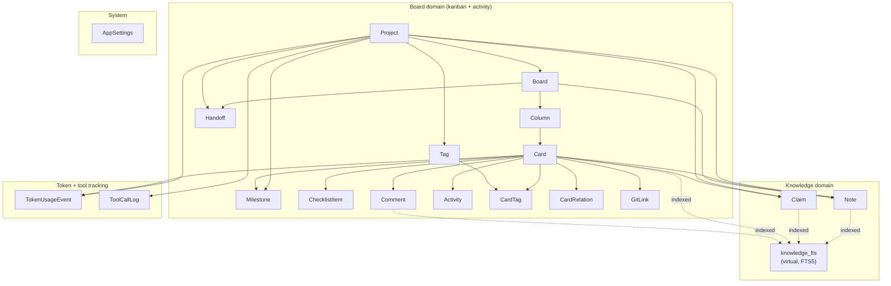

import { Aside } from "@astrojs/starlight/components";

A narrative tour of `prisma/schema.prisma`. As of v6.2.1 the schema has 18 Prisma-managed models grouped into four domains, plus one virtual table (`knowledge_fts`) that lives outside Prisma's view.

This is how Pigeon thinks about your work. If a model isn't here, it doesn't exist — and a few that *feel* like they should be here aren't:

- There's no `Decision` table — decisions are `Claim` rows with `kind = 'decision'`.
- There's no `Session` or `SessionFingerprint` table — sessions are referenced by ID columns on `TokenUsageEvent` and `ToolCallLog` but aren't first-class entities.
- There's no `Fact` table — facts collapsed into `Claim` during the v2.4 cutover.

The collapse-into-`Claim` pattern is deliberate. Four kinds of structured assertion (context, code, measurement, decision) share enough shape that one table with a `kind` discriminator beats four parallel tables with different schemas.

## At a glance

## Board domain

The kanban substrate. Owns `Project → Board → Column → Card` and the activity / metadata around cards.

| Model | Role | Most-touched fields |
|---|---|---|
| `Project` | Top-level workspace; one per repo | `slug`, `repoPath`, `defaultBoardId`, `nextCardNumber`, `metadata` (JSON) |
| `Board` | A kanban view inside a project | `staleInProgressDays`, `projectId` |
| `Column` | Vertical lane; carries the role | `role` (`backlog`/`todo`/`active`/`review`/`done`/`parking`), `position`, `isParking` |
| `Card` | Unit of work | `number` (project-scoped), `priority`, `createdBy`, `position`, `completedAt`, `metadata` (agent JSON) |
| `ChecklistItem` | Sub-card todo | `cardId`, `completed`, `position` |
| `Comment` | Card-scoped narrative | `authorType` (`HUMAN`/`AGENT`), `content` |
| `Activity` | Append-only audit log | `action`, `intent`, `actorType` |
| `CardTag` | Many-to-many junction | composite PK `(cardId, tagId)` |
| `Tag` | Project-scoped label | `slug` (immutable), `label` (mutable), `state` |
| `Milestone` | Card grouping with target date | `targetDate`, `state`, `position` |
| `CardRelation` | `blocks` / `related` / `parent` between cards | composite uniqueness `(fromCardId, toCardId, type)` |
| `GitLink` | Commit ↔ card binding | `commitHash`, `commitDate`, `filePaths` (JSON array) |
| `Handoff` | Append-only session continuity | `agentName`, `summary`, `workingOn`/`findings`/`nextSteps`/`blockers` (JSON arrays) |

### Things to know

- **`Card.number`.** Project-scoped, allocated via `Project.nextCardNumber`. The `(projectId, number)` unique index is the human-facing reference (`#212`).
- **`Card.completedAt`.** Set when the card enters a Done-role column, cleared when it leaves. Backs the Done-column sort so transactional `position` rewrites don't reshuffle.
- **`Activity.intent`.** Required on agent moves and deletes per `tracker.md` policy. The board UI surfaces it on the activity strip.
- **`Handoff` extracted from `Note` in v6.0.** Pre-#179 handoffs lived as `Note(kind="handoff")`. The migration script is `scripts/migrate-handoffs-from-notes.ts`.

## Knowledge domain

The unified narrative + structured-knowledge primitives. Two physical tables (`Note`, `Claim`) plus one virtual FTS5 index over both.

| Model | Role | Kinds / shapes |
|---|---|---|
| `Note` | Loose markdown — agent context, ad-hoc capture | `kind` defaults to `"general"`; can be project-, board-, or card-scoped |
| `Claim` | Structured assertion with kind-specific payload | `kind ∈ { context, code, measurement, decision }` |

### Why one Claim table for four kinds

The cutover (v2.4 → v2.5) collapsed `PersistentContextEntry`, `CodeFact`, `MeasurementFact`, and `Decision` into one `Claim` table with a `kind` discriminator and a JSON `payload` validated by Zod at the service boundary. The kind-specific schemas live in `src/lib/schemas/claim-schemas.ts` (`contextPayloadSchema`, `codePayloadSchema`, `measurementPayloadSchema`, `decisionPayloadSchema`). Existing tRPC consumers still see a Decision-shaped surface via the legacy adapter at `src/server/services/decision-service.ts`.

Service file: `src/lib/services/claim.ts` — factory pattern (`createClaimService(db)`) so both processes can construct against their own `PrismaClient` without crossing the boundary.

### `knowledge_fts` virtual table

Outside Prisma's view, lives in SQLite as an FTS5 virtual table. It indexes Note + Handoff + Claim + Card + Comment + repo markdown.

Because the table lives outside `prisma/schema.prisma`, Prisma sees it as drift and would refuse `db push`. The `service:update` script drops it (and its 5 shadow tables) before pushing schema; the FTS extension rehydrates it lazily on first knowledge search per project.

## Token + tool tracking domain

Two append-only tables that back the [Costs page](/costs/) and the Pigeon Overhead chip. Both carry `projectId` so per-project rollups don't need joins.

| Model | Role | Key columns |
|---|---|---|
| `TokenUsageEvent` | Per-session-per-model token usage | `(sessionId, model)` keying, 5-column token split (`input`, `output`, `cacheRead`, `cacheCreation1h`, `cacheCreation5m`), `signal` + `signalConfidence`, `cardId` (nullable) |
| `ToolCallLog` | Per-MCP-tool-call audit row | `toolName`, `toolType`, `sessionId`, `projectId` (nullable, post-#277), `durationMs`, `success`, `responseTokens` |

### `TokenUsageEvent.signal`

Added in #269 to surface which Attribution Engine tier produced the row's `cardId`. Values are `'explicit' | 'single-in-progress' | 'session-recent-touch' | 'session-commit' | 'unattributed'`. Nullable for pre-#269 rows; #270 (deferred) would backfill them.

The 5-column token split preserves Anthropic's pricing fidelity (1h cache create ≈ 2× input, 5m ≈ 1.25× input). Lumping would break later when the user changes pricing. OpenAI sessions store `0` for the cacheCreation columns.

Full subsystem treatment: [Attribution engine](/attribution/).

### `ToolCallLog.projectId`

Added in #277. Pre-#277 rows have `NULL`; the bridge through `TokenUsageEvent` collapsed to `[]` when the Stop hook didn't fire, zeroing the project's overhead even when MCP traffic was real. Stamping `projectId` directly at write time fixed the silent-zero failure mode.

Backfill: `scripts/backfill-tool-call-log-projectid.ts` fills NULL rows best-effort by joining on `sessionId` to `TokenUsageEvent`. Rows whose sessions never emitted a `TokenUsageEvent` stay NULL by design — they're still visible to `getToolUsageStats` (global) but excluded from project-scoped overhead aggregations.

## System domain

| Model | Role |
|---|---|
| `AppSettings` | Singleton row (`id = "singleton"`) holding token-pricing overrides as JSON. Read via `resolvePricing()`; fail-soft to `DEFAULT_PRICING` on parse error. |

That's the whole system table set. Doctor reports, version markers, and upgrade reports don't live in the DB — they're filesystem state read by `src/lib/upgrade-report.ts` and `scripts/doctor.ts`.

## Cross-cutting conventions

- **`@map("snake_case")`.** Every Prisma column maps to a `snake_case` SQL column even though the Prisma field is `camelCase`. Source-of-truth: `schema.prisma`. If you're writing raw SQL, use the snake form (`signal_confidence`, not `signalConfidence`).
- **`metadata` JSON columns.** `Project.metadata` and `Card.metadata` are agent-writable JSON blobs that don't render in the UI. They carry agent context (e.g. `tokenBaseline` on the project, scratch state on the card). Don't add new top-level columns when an existing `metadata` field would do.
- **Cascade discipline.** Cascading deletes on `projectId` propagate to most child tables. The exception is `Note` — `onDelete: SetNull` so orphaned notes survive a project delete. That's intentional: an agent's notes-about-a-thing shouldn't vanish with the thing.
- **No FK enforcement on `Claim.supersedesId` / `supersededById`.** Plain string IDs by convention. Cross-linking is enforced in the tool handler.

## Where the schema is going

- **#270** — historical backfill of `signal` for pre-#269 `TokenUsageEvent` rows. Deferred until #213's UX validates the engine.
- **#272** — populates `sessionTouchedCards` and `sessionCommits` for the Attribution Engine's tail signals (3 + 4). Currently both are stubbed to `[]`.
- The FTS path (`src/server/fts/`) and `buildBriefPayload` are still shared via cross-process imports — last 5 grandfathered violations on the boundary lint baseline. Slated for v6.3.

## See also

- [Architecture](/architecture/) — the three-layer rule and the lint that enforces it.
- [Attribution engine](/attribution/) — the deep-dive on `signal` / `signalConfidence`.
- [`docs/DATA-MODEL.md`](https://github.com/2nspired/pigeon/blob/main/docs/DATA-MODEL.md) on GitHub — in-repo source-of-truth with file:line citations.
