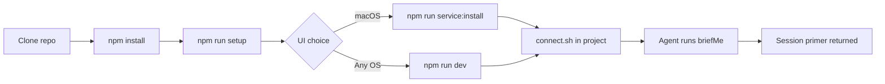

import { Steps, Aside, Tabs, TabItem } from "@astrojs/starlight/components";
import { Image } from "astro:assets";
import boardOverview from "../../assets/screenshots/board-overview.png";

This walks you from a clean checkout to a working `briefMe` call in under ten minutes. Everything runs on your machine — nothing to sign up for.

<Image
	src={boardOverview}
	alt="Board view after running the setup wizard with the tutorial project seeded — 20 cards across five columns demonstrating priorities, tags, checklists, comments, relations, and milestones."
/>

## Before you start

You need:

- **Node.js 20 or newer** — `node --version`
- **Git** — for the `#N` ↔ commit linkage feature
- **An MCP-compatible coding agent** — Claude Code, Codex, or anything that speaks MCP over stdio

<Aside type="note" title="macOS gets a bonus">
	The tracker includes a launchd integration so the UI runs as a background service on `localhost:3100` — always available, no dev server to babysit. The `npm run service:*` commands handle it. Linux and Windows work too, you just run `npm run dev` yourself.
</Aside>

## The ten-minute path

<Steps>

1. **Clone and install**

	```bash
	git clone https://github.com/2nspired/pigeon.git
	cd project-tracker
	npm install
	```

2. **Run the setup wizard**

	```bash
	npm run setup
	```

	It creates the SQLite database, optionally seeds a tutorial project with sample cards, and can connect an external project in one pass.

3. **Start the UI**

	<Tabs syncKey="platform">
		<TabItem label="macOS (background service)">
			```bash
			npm run service:install
			```

			Registers the UI as a launchd service on port 3100. It starts on login and restarts on crash. Run `npm run service:update` after pulling new code. Open [http://localhost:3100](http://localhost:3100).
		</TabItem>
		<TabItem label="Dev server (any OS)">
			```bash
			npm run dev
			```

			Open [http://localhost:3000](http://localhost:3000). First launch auto-creates the database if the wizard didn't.
		</TabItem>
	</Tabs>

4. **Connect one of your projects**

	From inside the project you want to track:

	```bash
	/path/to/pigeon/scripts/connect.sh
	```

	This writes a `.mcp.json` in the project root pointing at the tracker. Next time your agent starts a session in that directory, the tracker tools are available.

	Using a non-Claude agent?

	```bash
	AGENT_NAME=Codex /path/to/pigeon/scripts/connect.sh
	```

5. **Start a new chat and run `briefMe`**

	Open a new session with your agent in the connected project. Ask it to run `briefMe`. You'll see a compact primer come back — roughly 300–500 tokens of: the last handoff, changes since then, top work-next candidates, blockers, recent decisions.

	That's the loop. Every session starts this way.

</Steps>

## Zero → briefMe, visually



## After the wizard

Once you have a board running, the next thing to read is **[The session loop](../workflow/)** — it's the workflow the whole tool is built around.

If you want to give your agent a nudge toward using the tracker consistently, drop a short `Project Tracking` section into your project's `CLAUDE.md` (or `AGENTS.md`). Example:

```markdown
## Project Tracking

This project is tracked via Pigeon MCP. Call `briefMe()` at the start
of each conversation. Reference cards by `#number`. Call `endSession(...)`
before wrapping up.
```

## Keyboard shortcuts

The web UI supports a small set of shortcuts. More may be added over time.

| Keys | Where | What it does |
|---|---|---|
| `⌘K` / `Ctrl+K` | Anywhere | Open the command palette |
| `←` / `→` | Card detail sheet open | Step to the previous / next card in the current view's visible order |
| `Esc` | Editing title or description | Cancel edit and discard changes |
| `⌘↵` / `Ctrl+↵` | Editing description | Save changes |

Arrow-key card navigation honors the active filters, hidden roles, and sort mode of the view you're in. It won't fire while a text input, select, or dialog has focus, so it stays out of the way while you're editing.

## Things that sometimes go wrong

- **MCP shows "failed" in Claude Code** — run `/mcp`, then try `scripts/mcp-start.sh` manually from inside your project. Restart Claude Code after any `.mcp.json` change; MCP servers load at session start, they don't hot-reload.
- **Database is empty after clone** — `data/tracker.db` is gitignored so each install is fresh. Run `npm run setup` or `npm run dev` to create it.
- **Schema mismatch warning in `briefMe`** — `npx prisma db push` adds any new tables without losing data.
- **Forked the repo and docs won't deploy** — the GH Pages workflow requires `Settings → Pages → Source → GitHub Actions`. Set this once per fork before the first push.

Still stuck? See the [anti-patterns page](../anti-patterns/) for the usual suspects.

## Read next

- **[The session loop](../workflow/)** — the centerpiece workflow the whole tool is built around.
- **[Design rationale](../why/)** — the reasoning behind the constraints.
- **[Anti-patterns](../anti-patterns/)** — the ways people trip themselves up.
- **[MCP tools](../tools/)** — reference for every tool the agent can call.
