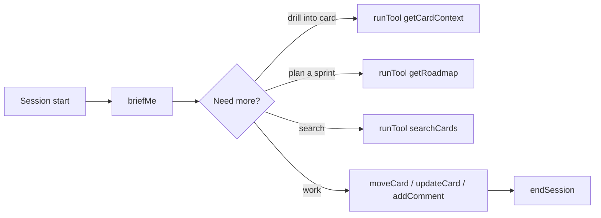
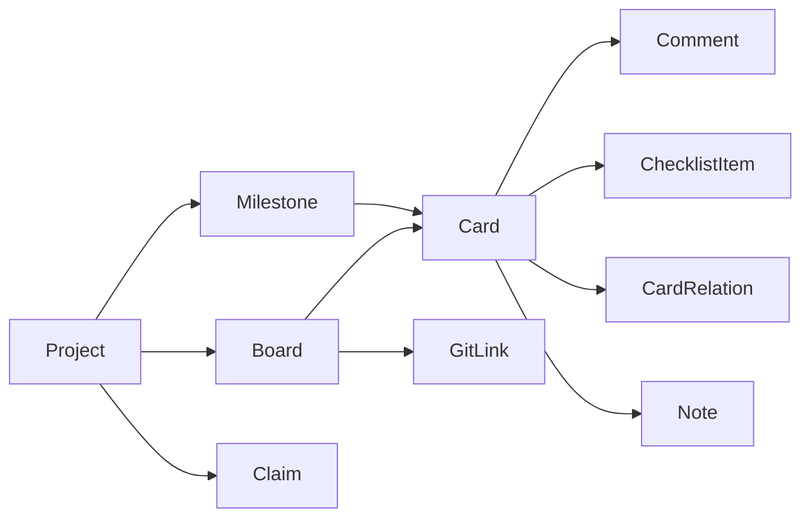

import { Aside } from "@astrojs/starlight/components";

The tracker exposes a two-tier MCP surface: a small set of **essential tools always loaded** plus a larger catalog of **extended tools** discoverable via `getTools` and executable via `runTool`. This page covers the shape of each tier so you know what the agent sees.

<Aside type="tip" title="Authoritative source">
	The running MCP server is the ground truth. Ask your agent to run `getTools()` to see the current catalog. The tables below are auto-generated from the tool registry via `npm run docs:sync`.
</Aside>

## Essential tools — always loaded

These are in the agent's context on every session. They cover the hot path: start, work, end.

{/* tracker:essentials:start */}
| Tool | What it does |
| --- | --- |
| `briefMe` | One-shot session primer — handoff, diff, top work, blockers, recent decisions, pulse. |
| `endSession` | Session wrap-up — saves handoff, links commits, reports touched cards, returns resume prompt. |
| `createCard` | Create a card in a column (by name). |
| `updateCard` | Update card fields; optional `intent`. |
| `moveCard` | Move a card to a column. Requires `intent`. |
| `addComment` | Add a comment to a card. |
| `registerRepo` | Bind a git repo path to a project (call after briefMe returns needsRegistration). |
| `checkOnboarding` | Detect DB state, list projects/boards, session-start discovery. |
| `getTools` | Browse extended tools by category. |
| `runTool` | Execute any extended tool by name. |
{/* tracker:essentials:end */}

That's the entire baseline agent context. Everything else is one `runTool` call away.

## Extended tools — on demand

Browsed via `getTools({ category })` and executed via `runTool({ tool, params })`.

{/* tracker:extended:start */}
| Category | Count | Tools |
| --- | --- | --- |
| `activity` | 1 | `listActivity` |
| `cards` | 5 | `bulkCreateCards`, `bulkMoveCards`, `bulkUpdateCards`, `createCardFromTemplate`, `deleteCard` |
| `checklist` | 3 | `addChecklistItem`, `bulkAddChecklistItems`, `toggleChecklistItem` |
| `comments` | 1 | `listComments` |
| `context` | 10 | `getCardContext`, `getMilestoneContext`, `getTagContext`, `listClaims`, `listFacts`, `planCard`, `queryKnowledge`, `rebuildKnowledgeIndex`, `saveClaim`, `saveFact` |
| `decisions` | 3 | `getDecisions`, `recordDecision`, `updateDecision` |
| `diagnostics` | 1 | `doctor` |
| `discovery` | 13 | `auditBoard`, `getBoard`, `getCard`, `getRoadmap`, `getStats`, `getToolUsageStats`, `getWorkNextSuggestion`, `listBoards`, `listProjects`, `listWorkflows`, `queryCards`, `renderStatus`, `searchCards` |
| `git` | 3 | `getCommitSummary`, `getGitLog`, `syncGitActivity` |
| `milestones` | 4 | `createMilestone`, `listMilestones`, `mergeMilestones`, `updateMilestone` |
| `notes` | 3 | `createNote`, `listNotes`, `updateNote` |
| `relations` | 3 | `getBlockers`, `linkCards`, `unlinkCards` |
| `session` | 5 | `listHandoffs`, `loadHandoff`, `recordTokenUsage`, `recordTokenUsageFromTranscript`, `saveHandoff` |
| `setup` | 4 | `createColumn`, `createProject`, `seedTutorial`, `setRepoPath` |
| `tags` | 4 | `createTag`, `listTags`, `mergeTags`, `renameTag` |
{/* tracker:extended:end */}

### How categories compose

Most sessions never reach past `briefMe` + the essentials + one or two `runTool` calls.

## Prompts (8)

MCP prompts are reusable session openers. Useful when you want to trigger a specific workflow.

| Prompt | Purpose |
| --- | --- |
| `resume-session` | Loads board state + last handoff + diff. Alternative to `briefMe`. |
| `end-session` | Superseded — returns a pointer to the `endSession` essential tool. |
| `onboarding` | Guided setup — `tutorial` seeds a sample project, `quickstart` creates a real one. |
| `deep-dive` | Loads focused context for deep work on a specific card. |
| `sprint-review` | Velocity, milestone progress, stale cards, blockers. |
| `plan-work` | Template for breaking work into cards + checklists. |
| `setup-project` | Step-by-step guide for setting up a new project on the tracker. |
| `holistic-review` | Reviews the board against the actual codebase — syncs state with reality. |

## Resources (5)

MCP resources are read-only URIs the agent can reference without a tool call.

| Resource URI | Provides |
| --- | --- |
| `tracker://board/{boardId}` | Full board state |
| `tracker://board/{boardId}/card/{number}` | Single card with all details |
| `tracker://board/{boardId}/handoff` | Latest session handoff |
| `tracker://project/{projectId}/decisions` | All project decisions |
| `status://project/{slug}` | Board-derived project status (replaces STATUS.md) |

## Card references

Cards get sequential numbers per project (`#1`, `#2`, `#3`). Reference them naturally — "working on #7", "move #12 to Done" — and the agent resolves them automatically against the board scope.

## Data model at a glance

- **Cards** are the primary unit of work.
- **Notes** + **Claims** are the two knowledge primitives — see `docs/RFC-NOTE-CLAIM-PRIMITIVES.md` for the shape.
- Session handoffs are stored as `Note` rows with `kind=handoff`; `endSession` writes them and `briefMe` reads the latest.
- Architectural decisions are stored as `Claim` rows with `kind=decision`.
- **GitLink** connects commits to cards via `#N` references.

## Extending the surface

If you want to add a tool, the pattern is:

1. Add the handler in `src/mcp/tools/<domain>.ts` following `ToolHandler<ParamsSchema>`.
2. Register it in `src/mcp/tool-registry.ts` with a category, description, and schema.
3. Bump `SCHEMA_VERSION` in `src/mcp/utils.ts` if you changed the data model.
4. Run `npm run docs:check` to keep the README tables honest (they're auto-generated from the registry).

The repo's `AGENTS.md` has the longer contributor guide.

## Read next

- **[The session loop](../workflow/)** — how these tools compose into a working session.
- **[Design rationale](../why/)** — why the essential + catalog split exists.
- **[Anti-patterns](../anti-patterns/)** — which tools to reach for when, and which to avoid.
