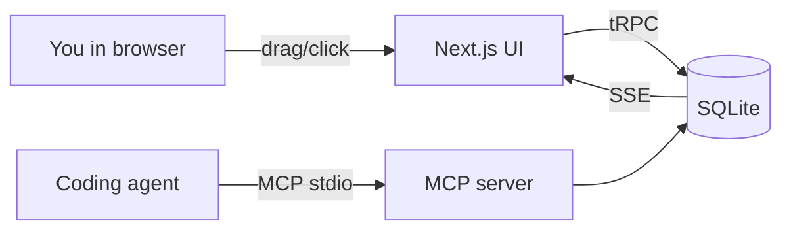
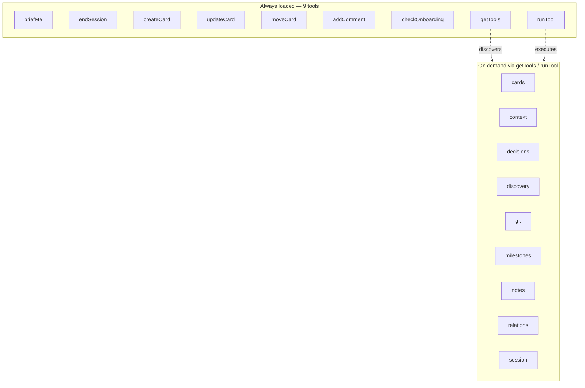

import { Aside } from "@astrojs/starlight/components";

Pigeon makes a few opinionated calls that aren't universal. This page explains the *why* behind each one — so if the tool doesn't fit your situation, you can see that clearly instead of fighting it.

## Local-first

**All data lives in a SQLite file on your machine.** No accounts, no sync server, no "workspace," no tenancy. One file, owned by you.

This is a deliberate trade, and it cuts against the grain of most productivity tools.

### What you give up

- **Team features.** There's no multi-user mode. Two humans can't collaborate on the same board. The design assumes one human + any number of agents working together.
- **Cloud sync.** If you work across machines, you sync the SQLite file yourself (Git, Syncthing, Dropbox, whatever).
- **Network access.** Nothing loads faster than local, but also nothing works when the file is on a machine you don't have.

### What you get back

- **Zero latency.** Every read and write is a local SQLite query. No round-trip to a cloud.
- **Zero setup friction.** No account creation, no OAuth, no email verification, no billing page. `npm install && npm run setup`.
- **Zero ongoing cost.** No server to pay for. No free-tier limits to hit.
- **Full data ownership.** You can open `data/tracker.db` in any SQLite tool and see the raw rows. Export, migrate, back up — it's all just SQL.
- **Durable trust.** Your agent's context, handoffs, and decisions don't evaporate if a vendor sunsets the product. The schema is in `prisma/schema.prisma` in the repo.

For a **solo developer working with a coding agent**, the trade is heavily net-positive. For a team looking for a shared kanban, this isn't the tool.

## MCP-native

The tracker isn't a board that happens to have an API. It's **a board built for an agent to read and write directly**, via [Model Context Protocol](https://modelcontextprotocol.io/). The web UI is the second surface, not the primary one.

Both clients read and write the *same* SQLite file. The UI broadcasts changes over Server-Sent Events, so when the agent moves a card, you see it move in your browser within milliseconds.

### Why MCP and not a REST API?

- **Agents discover tools natively.** The MCP manifest tells the agent what tools exist, what parameters they accept, and what they return. No prompt-engineering the API shape into context.
- **Structured errors over prose.** Tools return structured errors the agent can reason about, not HTTP status codes wrapped in English.
- **Stdio means no port.** The MCP server runs as a subprocess of the agent. No service to start, no port to expose, no CORS, no auth tokens.
- **Composable across agents.** Claude Code, Codex, and any other MCP-speaking agent all use the same tools the same way.

### Essential + catalog tools

A naive agent-facing API would either dump every tool into context (expensive) or force the agent to discover tools through trial and error (slow). The tracker splits the difference:

- **9 essential tools** are always loaded. They cover the hot path: start a session, create a card, update it, move it, comment on it, end a session.
- **50+ extended tools** live behind two meta-tools: `getTools` browses them by category, `runTool` executes them by name.

The result: small agent context at baseline, deep functionality a tool call away when the agent decides it needs it.

## Handoffs over memory

Agents don't persist memory between conversations. The tracker doesn't try to fake it. Instead it provides a **structured artifact** — the session handoff — that lives in the database and is explicitly loaded on the next session via `briefMe`.

This is a subtle but important distinction. It means:

- **You can see the handoff.** It's a row in the `session_handoff` table. You can read it, edit it, delete it.
- **The format is stable.** `summary`, `workingOn`, `findings`, `nextSteps`, `blockers` — not free-form prose the next agent has to interpret.
- **It's composable with git.** `endSession` runs `syncGitActivity`, so commits referencing `#N` get linked to cards automatically. Your git history is the other half of the handoff.

<Aside type="note" title="Why not just save the full chat transcript?">
	Because the transcript is mostly noise and the signal is the *decisions*. A 10k-token transcript compressed into a 200-token handoff is the win. If you need the transcript, your agent already saves it somewhere — the tracker doesn't try to duplicate that.
</Aside>

## Intent as a first-class field

Every card mutation the agent makes carries a short `intent` string — one sentence, ≤120 characters, human-visible.

This is the only non-obvious thing the tracker insists on. It exists because:

- **The board updates live.** You see moves happen. Silent moves are noise; annotated moves are signal.
- **Activity logs without reasons are useless post-hoc.** "Moved to Review" tells you nothing. "Moved to Review: tests green, ready for verify" lets you step in or trust the agent.
- **It forces the agent to think.** Writing intent is cheap. Writing *bad* intent is uncomfortable. So the agent tends to write better intent, which means it moves cards more deliberately.

## When this tool doesn't fit

Be honest about mismatches:

- **You're on a team.** Use Linear, GitHub Projects, Jira.
- **You want cloud access from multiple devices without syncing files.** Use a hosted tool.
- **You don't use a coding agent.** The value prop collapses — a local kanban without the agent integration is just a kanban.
- **You want mobile access, mobile push notifications, or custom workflows built for a PM role.** Out of scope.

If your situation is *"solo dev, working with an AI agent, wants to stop re-explaining context every session,"* the tool is built for you. Everything else is secondary.

## Read next

- **[The session loop](../workflow/)** — the practical workflow that falls out of these choices.
- **[Anti-patterns](../anti-patterns/)** — the ways this design gets misused.
- **[MCP tools](../tools/)** — the full tool surface the agent sees.
