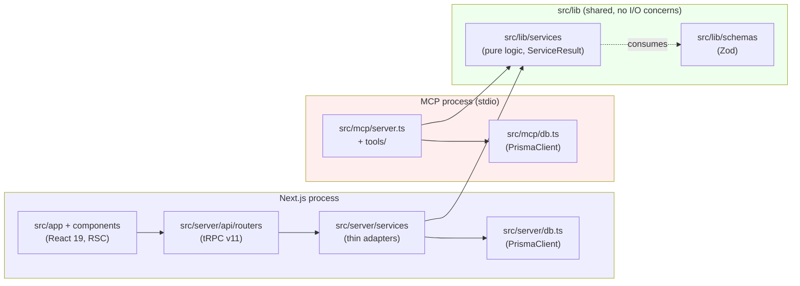

# Architecture

Pigeon ships two server processes against one SQLite file: the Next.js web app (UI + tRPC) and the MCP server (stdio, agent-facing). Both read and write the same `data/tracker.db`. The whole system is structured around one rule that came out of #260: **`src/server/` and `src/mcp/` never import from each other; both consume `src/lib/`.**

This doc explains why that rule exists, the `ServiceResult<T>` shape that lets shared logic stay portable, the lint that enforces it, and where new code goes.

## The three layers



The shaded boxes are *processes*, not just folders. Each owns a separate `PrismaClient`:

- `src/server/db.ts:30-39` — singleton, dev-mode `globalThis` cache for hot-reload.
- `src/mcp/db.ts:30` — singleton, no global cache (MCP doesn't hot-reload).

Both files independently call `initFts5(...)` and apply the FTS sync extension; neither imports the other's `db`.

## Why three layers

1. **MCP-as-separate-process.** The MCP server runs over stdio in the agent's child process tree, not as part of Next.js. It has to boot fast, it can't pull React or `next/server`, and it doesn't have a request lifecycle. Sharing a `PrismaClient` instance with the web app is impossible — they're different OS processes.
2. **Avoid tRPC creep into business logic.** If `cardService.create` returns `TRPCError`, then the MCP server has to import `@trpc/server` to *use* the function. That defeats the point. Services return `ServiceResult<T>`; routers convert to `TRPCError` at the edge.
3. **Testability.** `src/lib/services/attribution.ts` is a pure function with no Prisma access (`src/lib/services/attribution.ts:28-32` calls this out explicitly). The snapshot is built by a separate function, so the heuristic itself can be unit-tested with hand-built input.

## The `ServiceResult<T>` pattern

Every service function returns a discriminated union:

```ts
// src/server/services/types/service-result.ts:1-9
export type ServiceError = {
    code: string;
    message: string;
};

export type ServiceResult<T> = { success: true; data: T } | { success: false; error: ServiceError };
```

Routers unwrap at the edge by throwing `TRPCError` — see `src/server/api/routers/card.ts:20-25` for the canonical pattern:

```ts
const result = await cardService.listAll(input);
if (!result.success) {
    throw new TRPCError({ code: "INTERNAL_SERVER_ERROR", message: result.error.message });
}
return result.data;
```

MCP tool handlers do the equivalent with a different conversion (`err()` / `ok()` helpers in `src/mcp/utils.ts`). Same `ServiceResult` shape, different edge.

This works because the `code` strings are HTTP-flavored but not HTTP-bound (`NOT_FOUND`, `INTERNAL_SERVER_ERROR`, `LIST_FAILED`, etc.). Both edges can map them — `TRPCError`'s code enum and the MCP error envelope both accept the same conceptual buckets.

## The boundary lint

Mechanical enforcement lives at `scripts/lint-boundary.mjs`. Two rules (lines 28-43):

| Rule ID | Forbids | Why |
|---|---|---|
| `mcp-imports-server` | `src/mcp/**` importing from `@/server/...` | MCP must not depend on tRPC / Next surface area. |
| `server-imports-mcp` | `src/server/**` importing from `@/mcp/...` | The web app must not depend on stdio-MCP wiring. |

Decision-id: `a5a4cde6` (referenced in the lint reasons; surfaces in CHANGELOG `[6.2.1] / Refactor / #260`).

Two escapes exist:

1. **Per-line.** Append `// boundary-lint-allow — <reason>` to the offending import (`scripts/lint-boundary.mjs:71`).
2. **Baseline.** Existing pre-#260 cross-imports are grandfathered in `scripts/boundary-lint-baseline.json` (5 entries as of 6.2.1). The lint is a *ratchet*: new violations fail; baseline shrinks as cards land. Update with `npm run lint:boundary -- --update-baseline` (only when removing a grandfathered violation, never to silence a new one).

The lint runs in pre-commit (`#255` quality gates) and CI.

## Where does new code go?

The decision flowchart agents and contributors should run before adding a file:

```mermaid
flowchart TD
    Start[New code] --> Pure{Is it pure logic<br/>with no Prisma I/O?}
    Pure -- yes --> Lib1[src/lib/services or<br/>src/lib/schemas]
    Pure -- no --> Shared{Will both Next.js<br/>and MCP need it?}
    Shared -- yes --> LibFactory[src/lib/services<br/>factory: createX&#40;db&#41;]
    Shared -- no --> Edge{Which edge?}
    Edge -- HTTP/tRPC --> Server[src/server/services<br/>+ src/server/api/routers]
    Edge -- MCP stdio --> MCP[src/mcp/tools<br/>+ register-all-tools]
    Edge -- React UI --> Comp[src/components<br/>or src/app]

    style Lib1 fill:#efe
    style LibFactory fill:#efe
    style Server fill:#eef
    style MCP fill:#fee
    style Comp fill:#fef
```



A few worked examples:

| New thing | Goes in |
|---|---|
| Heuristic that picks one card from session state | `src/lib/services/` (pure function, no Prisma) — see `attribution.ts` |
| Service callable from both tRPC and MCP | `src/lib/services/` factory accepting `db: PrismaClient` — see `claim.ts:21-30` |
| New tRPC procedure for a UI page | Router in `src/server/api/routers/`, service in `src/server/services/` (thin adapter) |
| New MCP tool | `src/mcp/tools/<name>.ts` registered via `src/mcp/register-all-tools.ts` |
| Shared Zod schema | `src/lib/schemas/` |
| React component | `src/components/` (board UI) or `src/app/` (route-scoped) |

## Common pitfalls

- **Importing tRPC types into `src/lib/services/`.** Don't. Services return `ServiceResult<T>`; let the router convert. If you need typed errors, add a code string to `ServiceError.code`, not a `TRPCError` shape.
- **Putting Prisma calls in `src/lib/services/attribution.ts`-style files.** Pure logic stays pure. Build the snapshot in a separate file (`attribution-snapshot.ts`) that *does* take a `PrismaClient`.
- **Sharing the `db` instance across processes.** Each process owns its own. The web app's `db` lives in `src/server/db.ts`; the MCP's lives in `src/mcp/db.ts`. They're not interchangeable.
- **Adding a `from "@/server/..."` import inside `src/mcp/`.** The lint will catch it; before reaching for `boundary-lint-allow`, see if the shared logic should live in `src/lib/services/` instead. The 5 grandfathered violations are FTS init helpers + `buildBriefPayload`, deferred to v6.3 cards (`CHANGELOG.md` [6.2.1] / Refactor / #260).
- **Forgetting that `src/server/services/decision-service.ts` is a shim over Claim.** There's no `Decision` Prisma model — Decision is `Claim` with `kind = 'decision'`. See [`DATA-MODEL.md`](DATA-MODEL.md) for the full primitive map.
