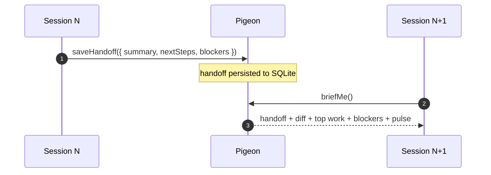

# How Pigeon works

This page is the long-form explanation of Pigeon's design — the *why*, the *who reads what*, and the session loop that ties it together. For installation and getting started, see the [README](../README.md). For everyday operation, the [docs site](https://2nspired.github.io/pigeon/) is the canonical reference.

## The problem

Coding-agent conversations have a natural expiration. Context windows fill, token costs climb, or you just want a clean slate. The question isn't *whether* the conversation ends — it's **what carries across the gap**.

Today the answer is usually "you do" — you re-explain what was planned, what's done, what was decided, what's stuck. Pigeon's answer is a structured handoff written at the end of one session and read at the start of the next. No re-explaining. No lost decisions. No "wait, what were we doing?"

The metaphor is in the name: agent A wraps a session with `saveHandoff`; the homing pigeon flies the message across the gap; agent B catches it at `briefMe` and starts in-context. Humans trigger the wrap-up with the `/handoff` slash command — that's the entry point. `saveHandoff` is the MCP tool it calls under the hood.



The handoff is a SQLite row. The wire is your local disk, not a network. The next session's first move is `briefMe`; what comes back is the previous handoff, a diff of what changed since, the top three work-next candidates, open blockers, recent decisions, and a one-line pulse.

## Built for two readers

| Reader | Sees | Reads/writes via |
|---|---|---|
| **You** | Kanban board in the browser. Drag-and-drop, columns, priorities, checklists, activity, real-time updates over SSE. | The web UI at `localhost:3100`. |
| **Your agent** | Structured tools over MCP. Cards, columns, comments, handoffs, decisions, dependencies, code links. | 10 essential tools always-on; 60+ extended tools discoverable via `getTools` and called via `runTool`. Context footprint stays small. |

The same SQLite file serves both, all the time, with no sync layer between them. If you can see it in the UI, the agent can see it. If the agent writes it, you see it live.

## The board

Cards are the units of work. Columns are state. Priority shows as a colored stripe. Tags filter; comment and checklist counters surface card depth at a glance. Card numbers (`#42`) stay stable across sessions and never recycle, even after deletion — agent references resolve months later.

The card detail panel is the single screen where humans and agents converge. Description for scope. Checklist for sub-state. Comments for guidance from the human to the next agent. Dependencies for graph structure (`blocks`, `blockedBy`, `relatedTo`). Activity feed for the audit trail.

## Project policy: `tracker.md`

Every connected project gets a `tracker.md` at its repo root — a Markdown file with YAML frontmatter that tells Pigeon how agents should behave on *this* project specifically. Hot-reloaded on every MCP tool call, git-versioned, reviewable in PRs.

```markdown
---
schema_version: 1
project_slug: my-project
intent_required_on:
  - moveCard
  - deleteCard
columns:
  In Progress:
    prompt: |
      Limit to 2-3 cards. Move here when you start writing code,
      not when planning.
---

# Project policy for my-project

Current phase: shipping the v2 onboarding flow. Treat anything
outside that as backlog unless it's blocking the release.
```

The rule: *if the human can't see and edit it where they'd naturally encounter it, the agent shouldn't trust it.* Full guide on the docs site: [Write a tracker.md](https://2nspired.github.io/pigeon/tracker-md/).

## MCP surface

Pigeon's MCP server registers under the key `pigeon` and runs over stdio. Ten essential tools are always-on (`briefMe`, `saveHandoff`, `createCard`, `updateCard`, `moveCard`, `addComment`, `registerRepo`, `checkOnboarding`, `getTools`, `runTool`). The remaining 60+ tools — cards, checklist, context, decisions, diagnostics, discovery, git, milestones, notes, relations, sessions, setup, tags — are discoverable via `getTools` and executable via `runTool`. The full reference, with parameter schemas: [MCP tools](https://2nspired.github.io/pigeon/tools/).

In the web app, press `?` anywhere to open the same catalog with deep links to docs.

## Session loop in one sentence

`briefMe` at session start (catch up), do the work, `saveHandoff` at session end (leave a trail) — repeat across sessions and the context never resets.
